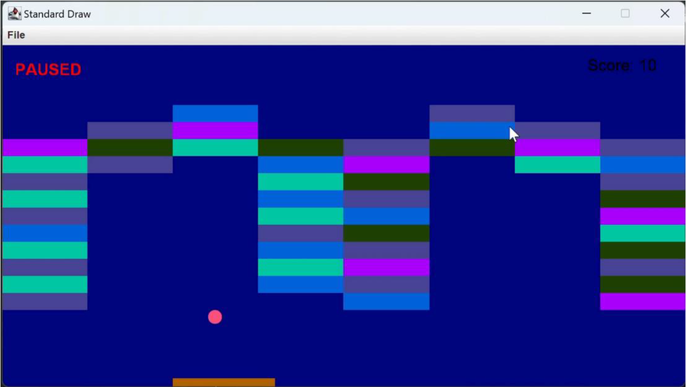
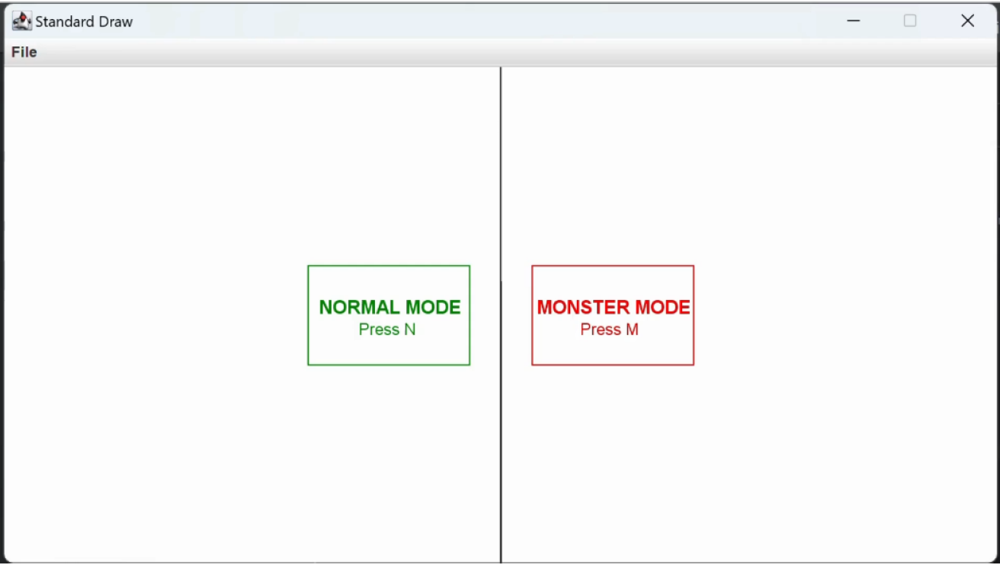

# 🕹️ DX-Ball: Physics-Based Brick Breaker
**Custom Game Engine with Real-Time Physics & Animation**

This project is a high-fidelity recreation of the classic **DX-Ball** game. It is built from scratch using Java to demonstrate core game development principles, including deterministic physics, collision detection, and modular game loops.

  
   
  <em>Figure 1: Game Environment</em>

## 🚀 Key Features
* **Custom Physics Engine:** Implements both surface and corner collisions using dot product calculations and vector reflections.
* **Real-Time Animation Loop:** Utilizes double-buffering via the StdDraw library to ensure smooth, flicker-free rendering.
* **Dynamic Gameplay Modes:** Includes a 'Monster Mode' featuring increased difficulty, paddle speed adjustments, and inverted controls.
* **Interactive UI:** Real-time score tracking, shooting angle adjustment, and pause/resume functionality.
* **Visual Feedback:** Dynamic background color shifts triggered by paddle collisions and localized victory/game-over states.

## 🏗️ Technical Implementation
* **Collision Detection:** Categorized into surface (velocity negation) and corner collisions (normal vector reflection).
* **Modular Logic:** Features a centralized loop for input handling, physics updates, and scene rendering.
* **Mathematics:** Employs vector math to calculate reflection angles and maintain constant ball velocity magnitude.

## 🛠️ Installation & Execution
1. Ensure you have the **JDK 8+** installed.
2. Include the `stdlib.jar` in your classpath.
3. Run the ModifiedMain file to choose between **Normal** or **Monster** mode. (Main file runs only **Normal** mode)

  
   
  <em>Figure 2: Decision State</em>

---
*Developed by Melih Efe Sonmez*
